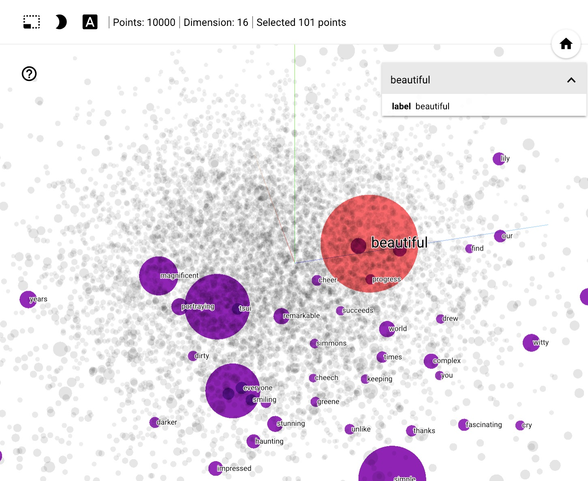

# Introduction
---

To start this off with a bit of personal background story: As far as formal education goes - I am no expert on AI. However that I managed to pick up and rapidly learn AI over the years - is due to the creative - but - intuitive nature of the ideas that are regularly churned out and experimented with, leading to state-of-the-art results.

[[snippet]]
|In this article, I will outline through some of the most popular breakthroughs in AI in a semi-chronological order, with hope to inspire people on diving in deeper and experiment more, maybe even revisit old techniques and apply on top of newer architectures.

I will skim on a lot of the intricacies and only focus on making a lot of this easy to understand and focus on the more intuitive parts. I highly encourage people to not be intimidated and read the original papers, with a lot of them detailing the process that lead the authors to the idea - that in itself is often extremely insightful and intriguing to read.

# Central theme of ideas
---

About data representation in NLP: or - "vectorization" of text: In Computer Vision, this is often done through a ImageNet - trained model (a story for another time), with self-supervised learning a relatively recent art. 

For text, however, self-supervised learning has always been a high priority effort - due to the lack of _labelled_ data. You will find a lot of ideas center around the creative use and manipulation of data to include extra data into the representation and reduce information loss. I will try to highlight this factor on every paper outlined here.

# Progress on word representation
---

# 1. One-hot encoding and TF-IDF

This is among the first and most naive way to apply machine learning for text.

### _One-hot Encoding_: 

Suppose you have a dictionary of 5 words `python•["I", "hello", "name", "is", "my"]`

The word "I" would be encoded as `python•[1, 0, 0, 0, 0]`

In practice, a vocabulary can go upwards to billions of words, which would easily overload storage with this method. To work around this problem, the _hashing trick_ is often used, where words would be put in a fixed number of _buckets_, and possibly have overlapping buckets - but as long as the number of buckets is sufficiently large, there's still a good estimation on word distinction.

Remarks: This is essentially a way to mathematically represent a program that would look in the text for specific mentions of certain words.

### _TF-IDF_:

One problem from one-hot encoding representation is that different words are treated similarly. A lot of times words such as "is", "my", "the" can appear in all sentences, therefore would provide faulty signal (as in, you don't want your model to use the word "the" as an indicator of 2 sentences being of different intents).

One way to address this problem is to remove all words in a list of _stop words_

```python
from nltk.corpus import stopwords
print(stopwords.words('english'))
```

TF-IDF attempts to, instead, count the number of word occurrences, downplaying the more common words and putting more weight on the less common words (stronger signal). This is a step up from one-hot encoding, but is still relatively naive. We will progress extremely fast from here.

Reference example of these methods: 
- [Classification of text documents using sparse features (from scikit-learn documentation)](https://scikit-learn.org/stable/auto_examples/text/plot_document_classification_20newsgroups.html)

# 2. Word2Vec

This paper was a milestone for the use of deep neural networks in NLP. It proposed 2 self-supervised tasks, called _"skip-gram"_ and _"continuous bags of words" (CBOW)_, briefly described below:

|Skip-gram|CBOW|
|:-:|:-:|
|Predict surrounding words|Predict middle word|
|`(<?>,<?>,brown,<?>,<?>) ➞ (the,quick,fox,jumps)`|`(the,quick,<?>,fox, jumps) ➞ brown`|

With _gradient descent_, it begins by randomizing - usually a 200-d or 300-d vector - for each words (instead of one-hot encoding), then train for this objective. By the end of training, the resulting word vectors gain an interesting property: the words that are closer in meaning are generally _drawn closer_ - meaning having shorter vector distance. One way to understand this intuitively is similar words tend to be interchangeable in a sentence.


You can try the [Tensorboard Embedding Projector](http://projector.tensorflow.org/) to see what this looks like.

Another property is that the word vectors can represent some aspects of the meaning, often demonstrated by that we can apply this kind of formula with the resulting word vectors:

`king - man + woman ~ queen` (gender)

or

`paris - france + poland ~ warsaw` (capital city)

Naturally this very cherry-picked and is mainly for illustrative purpose and actually doesn't have many applications, but is interesting nontheless.

### GloVe and FastText

GloVe is actually a entirely different formulation altogether (using co-occurence of words) to achieve the same result of _drawing similar words closer together_ in vector space. This resulted in, arguably, the state of the art word vectors for a very long time.

FastText is a more recent variation of the original Word2Vec formulation: Using the same training objectives, but more performance-optimized training code and more importantly, utilizing n-gram subword features. Specifically, for a 3-gram model, it would break down a word as follows:

`where ➞ (<wh, whe, her, ere, re>, <where>)`
(note the `<` and `>` markers to denote the beggining and end of the word)

The final word vector for `where` is then computed as the sum of the modular vectors.

This method has 2 advantages over the original paper: first, including subword information is helpful, at least for the English language - as e.g `national` and `nationalism` would share a lot of aspects in meaning. Second - this helps dealing with unseen or made-up words, by being able to approximate the meaning if it's based on existing words.

In practice, FastText results in relatively comparable performance with GloVe, but has the ability to account for unseen words.

Why I specifically dived into FastText is because _breaking down words into subword units_ would later become a staple for language models to limit vocabulary, which improves computational efficiency, and account for unseen words.

References:
- [Efficient Estimation of Word Representations in Vector Space (2013)](https://arxiv.org/abs/1301.3781)
- [GloVe: Global Vectors for Word Representation](https://nlp.stanford.edu/projects/glove/)
- [Enriching Word Vectors with Subword Information](https://arxiv.org/abs/1607.04606)

# 3. CoVe and ELMo

These papers are actually released much later than the initial Word2Vec era, and built upon ideas and achievements from _sentence representation_. I initially debated to include this in the 2nd part of the article, though this can be used on top of sentence representation in a modular fashion qualifies it for this part.

Initially, CoVe was introduced as a way to take contextual meaning into account for word vectors, through a machine translation task. It uses GloVe vectors, put through a LSTM-based machine translation model, and keep the resulting encoder (discarding the decoder). Note that the encoder is bidirectional (this will be relevant later). The resulting output of the encoder can be concatenated with the input GloVe vectors and used as input for downstream tasks.

The practical achivement of CoVe is that it can be used as an addition to all existing Word2Vec-based models and immediately gives a boost in performance. This quantifies how much performance can be gained from this feature. It also introduces using an additional character-level CNN model for adding character-level features, which it also proves to be able to contribute additional performance at a computational cost.

The improvements from CoVe were quickly forgotten, however, after ELMo was released. ELMo is a forward and backward language model concatenated together (note that this is not _true_ bidirectional) that uses character-level CNN features, trained on the _1 Billion Word Language Model Benchmark_ dataset from scratch. It made a big splash when it was released because:

- It could be used on top of all existing models as a replacement for word embeddings
- It managed to both employ character-level features (also giving it the ability to handle out-of-vocabulary words) and contextual information for words
- It improved state-of-the-art by a huge margin

ELMo is, essentially, the pinnacle of the RNN era - where research was still focused on RNN language models. Transformers architecture actually quickly took the stage afterwards. In part 2 I will go into more details on what language models _are_ and introduce Transformers-based models. Stay tuned!

References:
- [Learned in Translation: Contextualized Word Vectors](http://papers.nips.cc/paper/7209-learned-in-translation-contextualized-word-vectors.pdf)
- [Deep contextualized word representations](https://arxiv.org/pdf/1802.05365.pdf)