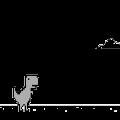

# Introduction
---

[[snippet]]
|In this tutorial I will briefly walk through how you can create an OpenAI Gym environment for the Google Chrome Dino game, and use Stable Baselines to quickly train an agent for it. Bonus: The environment can be easily extended to other browser games as well!.

This tutorial assumes you are at least familiar with Python in general. It will not go deep into model development or length explanations - that I'll save for another time. If you are new to machine learning, this will hopefully pique your interest 😋.

# Preparation
---

Ideally, you already have installed a environment manager for Python, such as `pipenv` or `Anaconda`/`Miniconda`. Create a new environment in Python 3.6 (with Python 3.7 you may have trouble installing Tensorflow because we will be using an older version).

We will be needing the following dependencies:

```
gym
selenium
opencv
Pillow
stable-baselines
```

Since this project will be to play the Dino game, we will also need Google Chrome and Chrome driver for selenium, which can be downloaded here: https://chromedriver.chromium.org/downloads . Select the latest version and download the binary for your OS, and extract it into your project's working folder.

# Selenium and the Chrome Dino game
---

For this part we will need some frontend knowledge and dig around with the Chrome inspector and console. The Chrome Dino game itself is comparably very convenient, but it might not be so for other games.

First we define the webdriver object with:

```python
import os
from selenium import webdriver

_chrome_options = webdriver.ChromeOptions()
_chrome_options.add_argument("--mute-audio")

_driver = webdriver.Chrome(
    executable_path=os.path.join(
        os.path.dirname(os.path.abspath(__file__)),
        "chromedriver"
    ),
    chrome_options=_chrome_options
)
```

After which we can launch the game by going to `chrome://dino`:

```python
from selenium.webdriver.common.keys import Keys

_driver.get('chrome://dino')

# trigger game start by pressing spacebar
_driver \
    .find_element_by_tag_name("body") \
    .send_keys(Keys.SPACE)
```

The game screen itself is rendered to a `canvas` with `class="runner-canvas"`, therefore we can easily get the entire game screen with `.toDataURL()`

The game also exposes a `Runner` object to global space (convenient! in the world of minifiers...), where we can get whether the game is still running with `js•console.log(Runner.instance_.playing)`. The score can be read from `js•console.log(Runner.instance_.distanceMeter.digits)` as an array of digits, though that is not entirely necessary in this case.

Similarly, controls to the game can be sent with `send_keys`.

```python
from selenium.webdriver.common.keys import Keys

_driver.find_element_by_tag_name("body").send_keys(Keys.SPACE)
```

For other games, however, `send_keys` only simulates a key press event. Sometimes the game would require the keys to be _held down_ instead, which will require sending the key down and key up events individually. In other cases, some actions in the game might require a certain _sequence_ of key presses and the odds might be too low for the AI to be able to figure out. In those cases, we can use Selenium's `ActionChains`:

```python
from selenium.webdriver.common.keys import Keys
from selenium.webdriver.common.action_chains import ActionChains

action_chains = ActionChains(_driver)
action_chains.key_down(Keys.ARROW_UP).perform()
action_chains.key_up(Keys.ARROW_UP).perform()
```

# Creating a custom OpenAI Gym environment
---

An _environment_ is how you can define the target that a reinforcement learning algorithm would run on. The idea is the algorithm, or _agent_, have to be able to observe the current environment's state, make actions, and know what kind of rewards that each action would bring. In the context of a simple game, the actions would be key presses, and the state can be pixels on the screen.

A minimal Gym environment would look like this

```python
import gym
from gym import spaces

class CustomEnv(gym.Env):

    def __init__(self):
        # action_space and observation_space can be anything from spaces
        self.action_space = spaces.Discrete()
        self.observation_space = spaces.Box()

    def step(self, action):
        pass
        # return observation, reward, done, extra_info

    def render(self, mode='human'):
        pass
        # return image array

    def reset(self):
        pass

    # not required
    def close(self):
        pass
```

In `__init__` you would define the `action_space` and `observation_space`. `action_space` in this case is straightforward: The Dino can either do nothing, jump up (spacebar or up arrow key) or duck (down arrow key), so we can use `python•spaces.Discrete(3)` to model this. For other games that might require more keys to control, you can adjust accordingly.

_Side note:_ In this case, initially, I thought the dino would only need jump and duck actions - and having a smaller action space would help the model learn faster. That did not end up being the case, since the duck action _can_ cancel out the jump action, therefore leaving only the 2 will make it hard for the agent to even jump past 1 obstacle.

## The step function

`step` is arguably the most important function to define for a Gym environment. This is where you would define how an action can affect the environment, and how to observe the current state of the environment. As can be seen from the skeleton code above, it is supposed to return 4 values as follows:

- `observation`: We need to convert the state of the environment into a fixed array format to feed into the model. In this case we can use the screenshot of the game directly, but a lot of other games might require additional information.

The interesting part of this is thanks to the power of _deep learning_, the agent can use the pixels on the screen as its input. This means we don't have to use any custom, hand-crafted object detection techniques for detecting obstacles. However, normally, neural network for _vision_ often resize images down to a very small size for performance. To put things into perspective, the state-of-the-art models usually use image sizes of up to 512x512px. This means you cannot just use 4K game screenshots as no conventional neural networks will be able to handle it. If need be, workarounds include splitting the image into parts, or isolate regions of interest.

As demonstration, for this game I cropped out only the part of the screen in front of the _Dino_ and resize the image down to 96x96px. It's worth noting, however, that the original Deep-Q-Learning on Atari games paper do just take the entire screen - including the scores and such. So that actually would still work for this game, it will just not be as efficient.



Because the game does speed up after a while, we attempt to capture part of this information by collating 4 latest screenshots for every observation - which is also what the authors of the original Deep Q Learning on Atari games paper did.

- `reward`: Reward modeling is arguably the hardest part of Reinforcement learning: RL is notorious for exploiting the environment. For example, if a game was designed that the score increases when you take respawnable power-ups, and the score is used as the model's reward, the model would learn to repeatedly take the power-up rather than get to the goal and finish the game, which is what happens here:

<iframe width="560" height="315" src="https://www.youtube.com/embed/tlOIHko8ySg" frameborder="0" allow="accelerometer; autoplay; encrypted-media; gyroscope; picture-in-picture" allowfullscreen></iframe>

_This agent actually manages to get ~20% higher scores than human players_

In our case, we can either use the score as the reward or, because we prefer stepwise reward to overall reward (easier for the model), just `.1` if the dinosaur still survives and `-1` when it crashes. This is to make the model disproportionately penalizes the agent when it crashes. This detail is unimportant, however, as most algorithms also considers episode-wise rewards, which would be the final score after the game ended.

In this case, the reward is straightforward because our goal - to survive as long as possible - is simple to model. Other games may require some trial and error for this step. Because how Reinforcement Learning works is first _random exploration_, essentially throwing things at the wall to see what sticks, it might never get to the goal if it's too hard to randomly press buttons and get to checkpoints or goals for rewards. That's why - for example - a game of _snake_ may require the _distance between the snake's head and the pellet_ to be factored into the reward.

- `done` is just a boolean value to indicate whether the game has ended.

And finally,

- `extra_info` is any extra information that does not fit into the other return values, often used for logging purposes. You can just return a `None` or empty `{}` value instead.

# Use stable-baselines to validate the environment
---

We can lift code straight out of `stable-baselines`'s [examples](https://stable-baselines.readthedocs.io/en/master/guide/examples.html?highlight=gif#id2) and modify it _just_ a bit to fit our needs.

```python
import os

from stable_baselines import DQN
from stable_baselines.deepq.policies import CnnPolicy
from stable_baselines.common.vec_env import DummyVecEnv

env_lambda = lambda: ChromeDinoEnv(
    screen_width=96,
    screen_height=96,
    chromedriver_path=os.path.join(
        os.path.dirname(os.path.abspath(__file__)),
        "chromedriver"
    )
)
save_path = "chrome_dino_dqn_cnn"
env = DummyVecEnv([env_lambda])

model = DQN(
    CnnPolicy,
    env,
    verbose=1,
    tensorboard_log="./.tb_chromedino_env/",
)
model.learn(total_timesteps=100000)
model.save(save_path)

model = DQN.load(save_path, env=env)

obs = env.reset()

while True:
    action, _states = model.predict(obs)
    obs, reward, done, info = env.step(action)
    env.render(mode="human")
```

This will lead to pretty decent results - if only for demonstrative purposes. You can increase the number of training timesteps for better results (might take a few million steps to master the game). It will, by default, use Deep-Q Learning along with extensions (Dueling, Double-DQN and Prioritized Experience Replay).

As `DQN` does not support multiprocessing, however, we can opt for `PPO` to hasten the training process. Important note though: even if I can use these algorithms interchangeably in these cases, a lot of times, some algorithms are designed for certain scenarios, while others might not even converge on certain problems. It might even take some trial and error to choose the right algorithm. A starting guideline can be found on `stable-baselines` docs: https://stable-baselines.readthedocs.io/en/master/guide/rl_tips.html#which-algorithm-should-i-use

With this we can train and run 4 agents at once, simultaneously - which can speed up training by a lot. Here is an agent that has been trained for a few hours with the `PPO` algorithm: (screenshots are taken directly from Chrome, the black background is due to transparency)


The complete version of the code can be found here:

`gist:luungoc2005/979c279effc9a2bd3de78ea57613a36f#gym_chrome_dino_game.py`

Further Reading:
- DQN paper: https://arxiv.org/abs/1312.5602
- `stable-baselines` documentation: https://stable-baselines.readthedocs.io/